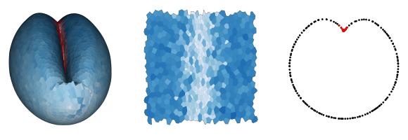

# Invagination



[](https://zenodo.org/badge/latestdoi/185421680)

This is a mesoderm invagination simulation package for the article:

**Epithelio-mesenchymal transition generates an apico-basal driving force required for tissue remodeling**

Mélanie Gracia <sup>1</sup>, Corinne Benassayag <sup>1</sup>, Sophie Theis <sup>1, 2</sup>, Amsha Proag <sup>1</sup>, Guillaume Gay <sup>2</sup> and Magali Suzanne <sup>1</sup>

<sup>1</sup> LBCMCP, Centre de Biologie Intégrative (CBI), Université de Toulouse, CNRS, UPS, France

<sup>2</sup>  Morphogénie Logiciels, 32110 St Martin d’Armagnac, France

The article is currently under revision.

## Dependencies

- python > 3.6
- tyssue >= 0.3.3


## Installation

This package is based on the [`tyssue`](https://tyssue.readthedocs.org) library and its dependencies.

The recommanded installation route is to use the `conda` package manager. You can get a `conda` distribution for your OS at https://www.anaconda.com/download . Make sure to choose a python 3.6 version. Once you have installed conda, you can install tyssue with:

```bash
$ conda install -c conda-forge tyssue
```

You can then download and install invagination from github:

- with git:

```bash
$ git clone https://github.com/DamCB/invagination.git
$ cd invagination
$ python setup.py install
```

- or by downloading https://github.com/DamCB/invagination/archive/master.zip ,  uncompressing the archive and running `python setup.py install` in the root directory.

## Licence

This work is free software, published under the MPLv2 licence, see LICENCE for details.


&copy; The article authors -- all rights reserved
